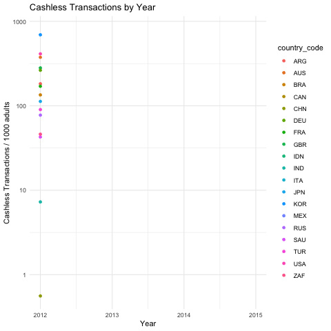
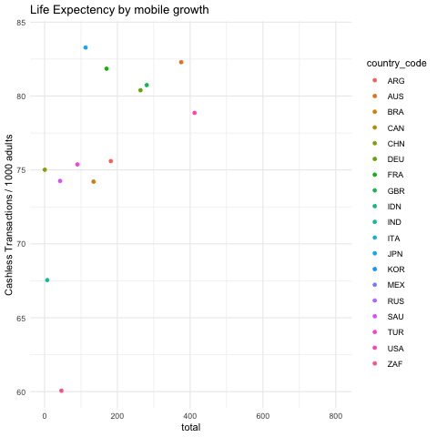

**#About This Project**

The goal of the this project is to showcase how certain financial indicators can be used as a medium to understand the impact of daily life and quality of life. The data used here represents data about the G20 countries only, but the methodologies can be used on any country so long as the data is available. 

**#Raw Data Source**

The sources of my data are: 

1. World Bank G20 Financial Indicators 
http://datatopics.worldbank.org/g20fidata/ 

    This data shows different financial indicators for countries around the world, over time when available.  

2. Our World Data on Life Expectency 
https://ourworldindata.org/life-expectancy 
    
    This data is a list of all countries and their life expectencies in a temporal manner.
    

**#Data cleaning process & storing**

All of my data exists in the raw_data >folder. 

All of this data is cleaned, joined when needed, and ready to be used in the final project. 


### These visualizations are examples of digging into the affect of more cashless transactions taking place in a country on. For example, the mapping between life expectation and increase in access to digital banking (cashless transactions).
```
**#Visualization Plan**

### This visualization is an example of digging into the affect of more cashless transactions taking place. For example, the mapping between life expectation and increase in access to digital banking (cashless transactions)
<!--render the gif image-->


This visualization is an example of digging into the affect of more cashless transactions taking place. For example, the mapping between life expectation and increase in access to digital banking (cashless transactions)
<!--render the gif image-->



